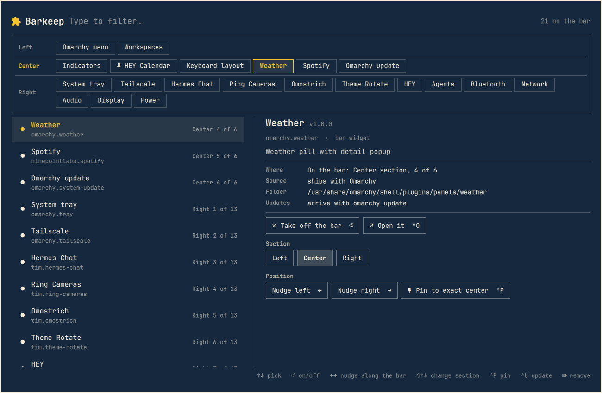
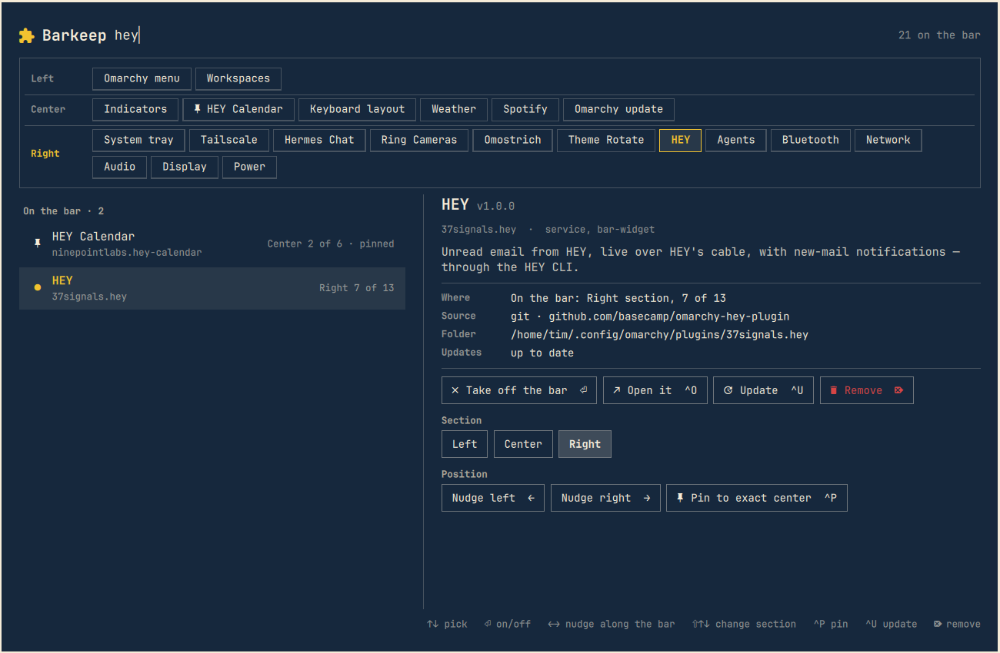
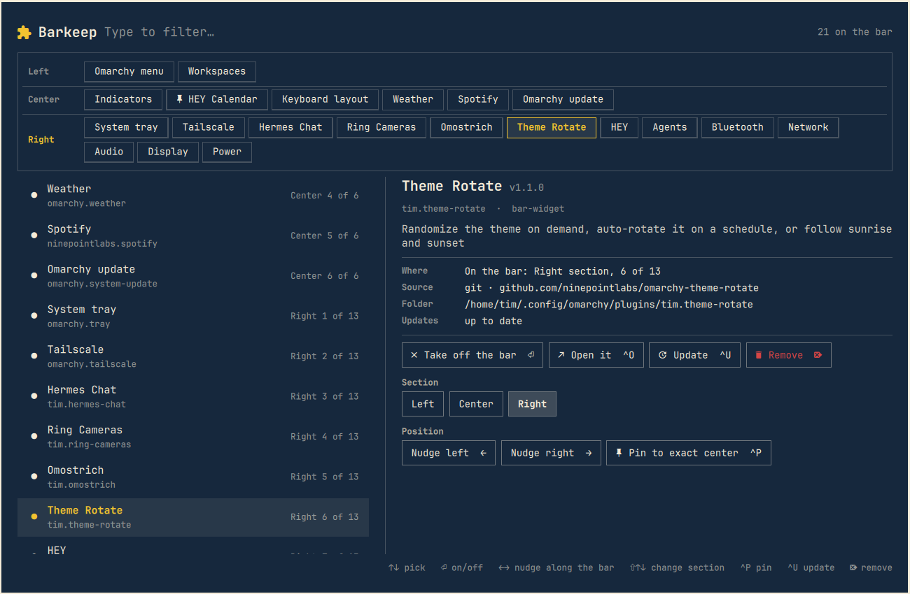
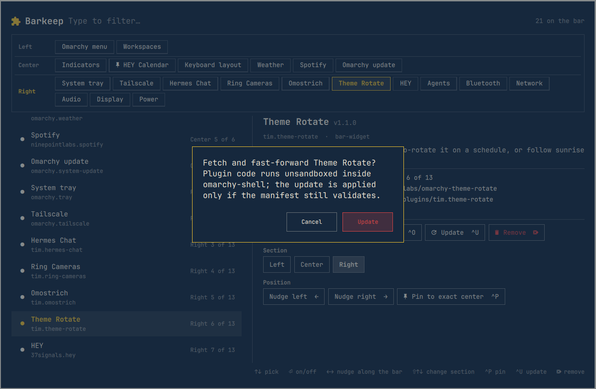

# Barkeep

**Barkeep tends your Omarchy bar.** One overlay, summoned from a key, that shows
every plugin the shell knows about and lets you arrange, pin, switch, update
and remove them, without memorising a single `omarchy plugin` or `omarchy bar`
command.



## What it does

Omarchy ships a powerful plugin system, but managing it means knowing which
of five commands to type. Barkeep puts it all in one place:

- **See the bar as it is.** Three rows, Left, Center and Right, with every
  widget in order. Below that, every plugin grouped by where it lives: on the
  bar, off the bar, panels and overlays, services, bar options.
- **Arrange.** Nudge a widget along its section, move it to another section,
  or pin it to the exact center of the screen (Omarchy's `centerAnchor`).
- **Switch.** Put a widget on the bar or take it off. Enable or disable a
  panel, overlay or service. Choose which bar is in use.
- **Update.** Barkeep checks every git-managed plugin for new commits and
  lists them before you pull, one plugin at a time or all at once.
- **Remove.** Delete a third-party plugin, after a confirmation.
- **Open.** Jump straight into a plugin's own panel or popup.

Every change lands in `~/.config/omarchy/shell.json` through the stock
`omarchy plugin` and `omarchy bar` commands, so the bar updates instantly and
nothing else touches your config.

It is not a bar button. Barkeep is an overlay you bring up when you need it.

## Install

```bash
git clone https://github.com/ninepointlabs/barkeep ~/Projects/barkeep
cd ~/Projects/barkeep
./install.sh
```

The installer copies the plugin to `~/.config/omarchy/plugins/ninepointlabs.barkeep`,
enables it in the running shell, links a `barkeep` command into `~/.local/bin`,
and adds a "Barkeep" entry to the app launcher.

Omarchy's own plugin command works too:

```bash
omarchy plugin add https://github.com/ninepointlabs/barkeep.git --enable
```

That gives you the overlay and the keybinding below; the `barkeep` command
and the launcher entry come only from `install.sh`.

### Bind a key

Add one line to `~/.config/hypr/bindings.lua` (Hyprland reloads on save):

```lua
o.bind("SUPER + B", "Barkeep (plugins)", "omarchy-shell shell toggle ninepointlabs.barkeep")
```

`SUPER + B` is free in stock Omarchy; check `omarchy menu keybindings --print`
if you have your own bindings.

### Add it to the Omarchy menu (optional)

In `~/.config/omarchy/extensions/omarchy-menu.jsonc` (also hot-reloads):

```jsonc
"setup.plugin.barkeep": {"icon":"󰐱","label":"Barkeep","action":"omarchy-shell shell toggle ninepointlabs.barkeep"},
```

That puts it under Setup › Plugins › Barkeep.

## Uninstall

```bash
cd ~/Projects/barkeep && ./install.sh --uninstall
```

This disables the plugin, deletes the runtime copy, and removes the `barkeep`
link and the launcher entry. Remove the keybinding and menu lines by hand if
you added them. Or, from inside Omarchy: `omarchy plugin remove ninepointlabs.barkeep`.

## Using it

### Pick a plugin

Press `SUPER + B`. The cursor is on the first widget; `↑` and `↓` move it, or
click a row, or click a chip in the bar strip. Start typing to filter, exactly
like the Omarchy menu, and `Esc` clears the filter.



### Arrange the bar

With a widget selected, the details pane shows where it is and offers a
Left / Center / Right picker plus nudge and pin buttons. On the keyboard,
`←` and `→` nudge it along its section, `Shift+↑` and `Shift+↓` move it to
the section above or below, `Ctrl+P` pins it to the exact center. Watch the
bar and the strip update as you go.

### Switch, update, remove

`Enter` puts a widget on the bar or takes it off, enables or disables anything
else, or makes a bar option the bar in use. Third-party git plugins show their
source and whether new commits are waiting; `Ctrl+U` updates one, `Ctrl+Shift+U`
updates everything that has an update. `Delete` removes a third-party plugin.

Updates and removals always ask first.





### Keys

| Key | Does |
|-----|------|
| ↑ / ↓ | pick a plugin |
| Enter | on/off · put on / take off the bar · use this bar |
| ← / → | nudge the widget along the bar within its section |
| Shift+↑ / Shift+↓ | move the widget to the section above / below |
| Ctrl+P | pin to the exact center / unpin |
| Ctrl+O | open the plugin's panel or popup |
| Ctrl+U / Ctrl+Shift+U | update this plugin / every plugin with an update |
| Delete | remove (asks first) |
| Ctrl+R | re-check for updates |
| type | filter |
| Esc | clear the filter, then close |

### Command line

```
barkeep            toggle the overlay
barkeep show|hide
barkeep status     open / closed
barkeep check      JSON git state for every plugin folder
```

## How it works

- `Barkeep.qml` is an `overlay` plugin loaded by `omarchy-shell`. Since
  Omarchy 4.0.3 a third-party plugin no longer receives the shell's plugin
  registry or config (it gets a facade scoped to itself), so Barkeep asks
  `bin/barkeep-ops catalog` for the picture instead: the same manifest scan
  the shell's own `PluginRegistry` runs over `$OMARCHY_PATH/shell/plugins`
  and `~/.config/omarchy/plugins`, plus `shell.json`. It refreshes on every
  open and after every change.
- Changes go through `bin/barkeep-ops mutate`, which wraps the stock
  `omarchy plugin enable|disable` and `omarchy bar use|move` commands (and
  the shared `omarchy-shell-config` helper for the center anchor). Those
  write `shell.json` atomically and ask the shell to reload it. Nothing is
  written anywhere except `shell.json`, and only through Omarchy's own tools.
- `inspect` reports git state for every plugin folder. `update` and `remove`
  run the stock `omarchy plugin update --yes` and `omarchy plugin remove
  --yes`, then bring Barkeep back with the outcome in its status line. They
  run detached because the shell rescans its plugins afterwards, which
  rebuilds every open overlay, Barkeep included.
- `BarkeepModel.js` holds the pure model code: grouping, filtering, the bar
  strip, and the action set for each plugin.

Barkeep runs no plugin code itself and never touches `/usr/share/omarchy`.

### Dependencies

Everything is already on a stock Omarchy install: `omarchy-shell` (Quickshell),
`git`, `jq`, `rsync`, `timeout` from coreutils.

## Security notes

- Opening Barkeep runs `git fetch` in every git-managed plugin folder, at most
  once per five minutes (`Ctrl+R` forces it), so it can show what an update
  would pull. That contacts each plugin's configured remote; nothing else
  leaves the machine.
- Every git command runs with `core.fsmonitor`, hooks, credential helpers,
  `ext::` transports and local `upload-pack` overridden, and the same
  overrides are passed to the stock update command through
  `GIT_CONFIG_PARAMETERS`. A plugin folder's own `.git/config` cannot make
  Barkeep execute anything from it.
- Updates and removals always ask first. Updates are applied by the stock
  `omarchy plugin update`, which fast-forwards only, re-validates the manifest
  and rolls back if that fails. Plugin code runs unsandboxed inside
  `omarchy-shell`, exactly as after `omarchy plugin update --yes`.
- All plugin-supplied text (names, descriptions, commit subjects, remote URLs,
  git error output) is rendered as plain text.
- The helper accepts plugin folder names only (`[A-Za-z0-9][A-Za-z0-9._-]*`,
  no `..`), passes them as arguments rather than through a shell, and builds
  all JSON with `jq`.
- The IPC surface (`omarchy-shell shell call ninepointlabs.barkeep …`) is the
  same one every shell plugin has; anything that can reach your shell socket
  can already rearrange the bar. The `renderTo` development helper only writes
  a `.png` under `~/.cache`.

## Development

Edit in this repo, run `./install.sh`, then `omarchy restart shell` (the
shell's hot reload keeps the old component cached for overlays). Do not
restart the shell while the session is locked.

Any public function is reachable while the overlay is open, which is how the
layout actions are tested headlessly:

```bash
omarchy-shell shell call ninepointlabs.barkeep selectId omarchy.weather
omarchy-shell shell call ninepointlabs.barkeep runAction sectionRight
omarchy-shell shell call ninepointlabs.barkeep renderTo ~/.cache/barkeep.png
```

## License

MIT. See [LICENSE](LICENSE).
